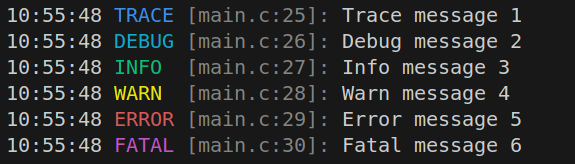
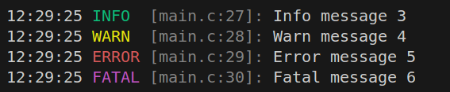
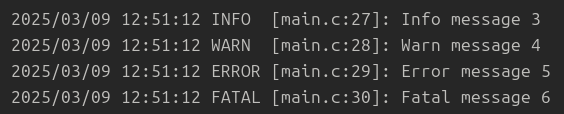
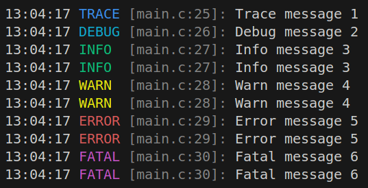
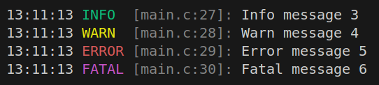
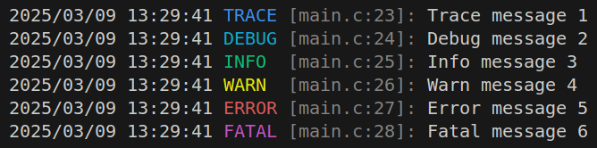
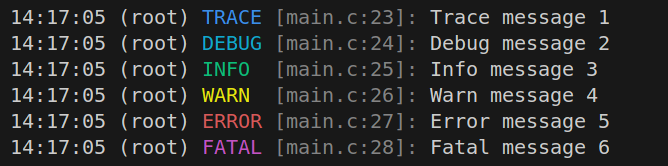
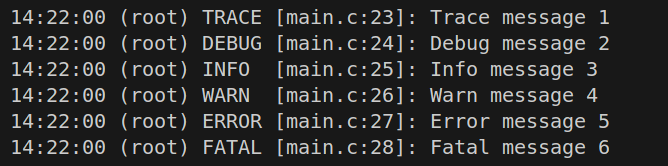
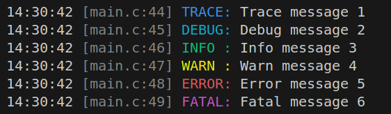
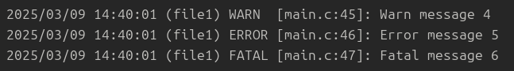

# Logger C
[](LICENSE) 



A lightweight, flexible logger library for the C language, inspired by [log4.c](https://github.com/rxi/log.c) project and Python's [logging](https://docs.python.org/3/library/logging.html) package. 
This library provides a simple yet powerful way to log messages with different levels, handlers, and formatting options. It supports both stream and file handlers, and customizable log formats.

## Features
- Default root handler (a stream handler) for immediate use, you don't need to create it.
- More file and stream handlers can be added.
- Multiple log levels: `TRACE`, `DEBUG`, `INFO`, `WARN`, `ERROR`, `FATAL`.
- Customizable log formatting with color support for terminals.
- Flexible date/time formatting.

## Simple Usage
1. Clone or download the repository:
   ```bash
   git clone https://github.com/JeepWay/logger-c.git
    ```
2. Include the header file [logger.h](logger/logger.h) and source file [logger.c](logger/logger.c) in your project. The following is an example (main.c): 
    ```cpp
    #include <stdio.h>
    #include <stdlib.h>
    #include "logger/logger.h"
    int main(void)
    {
        log_trace("Trace message %d", 1);
        log_debug("Debug message %d", 2);
        log_info("Info message %d", 3);
        log_warn("Warn message %d", 4);
        log_error("Error message %d", 5);
        log_fatal("Fatal message %d", 6);
        return 0;
    }
    ```
3. Compile your program with a C compiler (e.g., gcc), and execute it.
    ```bash
    gcc -o main logger/logger.c main.c
    ./main
    ```
4. You will see the result in the console like the top picture.


## Basic Usage
The following `DEFAULT` values are defined in [logger.h](logger/logger.h#L26). You can use them to set the default values for convenience, or you can specify your own values.

### 1. Change default log level
The default log level of root handler is `TRACE`. You can change the log level by using `log_set_level(char* name, size_t value)`, where `name` is the handler name and `value` is the log level.
```cpp
log_set_level(DEFAULT, LOG_INFO);
// Equal to the following line
log_set_level("root", LOG_INFO); 
```


### 2. Add a file handler
The default setting only contains a stream handler (root handler). You can add a file handler to log messages to a file by using `log_add_file_handler(char *filename, char *filemode, size_t level, char *name)`, where `filename` is the name of the file, `filemode` is the mode to open the file, `level` is the log level, and `name` (can't be `NULL`) is the handler name.
```cpp
log_add_file_handler(DEFAULT, DEFAULT, DEFAULT_LEVEL, "file1");
// Equal to the following line
log_add_file_handler("logger/program.log", "a", LOG_INFO, "file1");
```
And then you can see the log messages in the file `logger/program.log`.



### 3. Add a stream handler
You can add a stream handler to log messages to the console by using `log_add_stream_handler(FILE *fp, size_t level, char *name)`, where `fp` is the file pointer, `level` is the log level, and `name` (can't be `NULL`) is the handler name.
```cpp
log_add_stream_handler(DEFAULT, DEFAULT_LEVEL, "bash2");
// Equal to the following line
log_add_stream_handler(stderr, LOG_INFO, "bash2");
```
You will see the log messages in the console. Since the log level of `bash2` is `INFO` and the log level of `root` is `TRACE`, only log messages with level `INFO` and above will appear twice in the console (once from each handler).



### 4. Make a handler quiet
Every handler is not quiet by default. You can make a handler quiet by using `log_set_quiet(char* name, bool value)`, where `name` is the handler name and `value` is a boolean value.
```cpp
log_set_quiet("root", true);
log_add_stream_handler(DEFAULT, DEFAULT_LEVEL, "bash2");
```
The console will only show the log messages from the `bash2` handler, as the `root` handler is quiet.



### 5. Change data and time format
You can change the date and time format by using `log_set_date_fmt(char* name, char* date_fmt)`, where `name` is the handler name and `date_fmt` is the date and time format.
```cpp
log_set_date_fmt("root", DEFAULT_DATE_FORMAT3);
// Equal to the following line
log_set_date_fmt("root", "%Y/%m/%d %H:%M:%S");
```


### 6. Change text format
The default text format for stream is [color_fmt1](logger/logger.c#L201) function, for file is [no_color_fmt1](logger/logger.c#L215) function. 
The avaliable text format function are `color_fmt1`, `color_fmt2`, `no_color_fmt1`, `no_color_fmt2`.
You can change the text format by using `log_set_fmt_fn(char* name, log_fmt_t fmt)`, where `name` is the handler name and `fmt` is the function pointer to the text format function.
```cpp
log_set_fmt_fn("root", color_fmt2);
```
You will see the name of the handler in the log messages.



You can also change the text from colorful to plain. Note that the colorful format only works in the terminal and doesn't work in the text file.
```cpp
log_set_fmt_fn("root", no_color_fmt2);
```


If you don't like the default text format, you can define your own text format function and use it. Below is an example of a custom text format function.
```cpp
void custom_fmt(record_t *rec, const char *time_buf)
{
    static const char *fmt = "%s\x1b[0m \x1b[90m[%s:%d] %s%-5s:\x1b[0m ";
    fprintf(rec->hd_fp, fmt, time_buf, rec->file, rec->line, 
        level_colors[rec->level], level_strings[rec->level]);
}

log_set_fmt_fn("root", custom_fmt);
```


### 7. Change dump log function
The default dump log function is [dump_log](logger/logger.c#L190) function. 
```cpp
void dump_log(record_t *rec)
{
    char time_buf[32];
    time_buf[strftime(time_buf, sizeof(time_buf), rec->hd_date_fmt,
                      rec->time)] = '\0';
    rec->hd_fmt_fn(rec, time_buf);
    vfprintf(rec->hd_fp, rec->msg_fmt, rec->ap);
    fprintf(rec->hd_fp, "\n");
    fflush(rec->hd_fp);
}
```
You can change the dump log function by using `log_set_dump_fn(char* name, log_dump_fn dump_fn)`, where `name` is the handler name and `dump_fn` is the function pointer to the dump log function.


## Examples
```cpp
#include <stdio.h>
#include <stdlib.h>
#include "logger/logger.h"

int main(void)
{
    char *f1 = "file1";
    log_add_file_handler("logger/program.log", "w", LOG_WARN, f1);
    log_set_fmt_fn(f1, no_color_fmt2);
    log_set_quiet("root", true);

    log_trace("Trace message %d", 1);
    log_debug("Debug message %d", 2);
    log_info("Info message %d", 3);
    log_warn("Warn message %d", 4);
    log_error("Error message %d", 5);
    log_fatal("Fatal message %d", 6);
    return 0;
}
```
You will only see the log messages in the file `logger/program.log` with the log level `WARN` and above. Nothing will appear in the console.




## Contributions
Contributions are welcome! Please submit a pull request or open an issue on the repository. Here are some ways you can contribute:
* Implement a filter function, like the [filter class](https://docs.python.org/3/library/logging.html#filter-objects) in Python's logging package, to filter log messages based on the maximum log level and handler name.
* Make the sequential search of handlers more efficient, for example, hashing the handler names into id.
* Prevent adding handlers with the same name.
* Add more safety checks in [logger.c](logger/logger.c#L175) to ensure robustness and prevent potential issues.


## Reference
* [log4.c](https://github.com/rxi/log.c)
* [Python logging module](https://docs.python.org/3/library/logging.html) - Comprehensive guide on Python's logging package.
* [Logging in Python](https://realpython.com/python-logging/) - An article to introduce the logging package.


## License
This library is free. You can redistribute and modify it under the MIT License. See the [LICENSE](LICENSE) for details.
